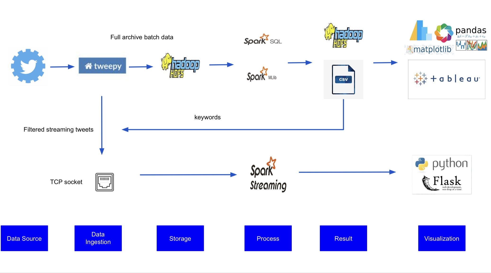
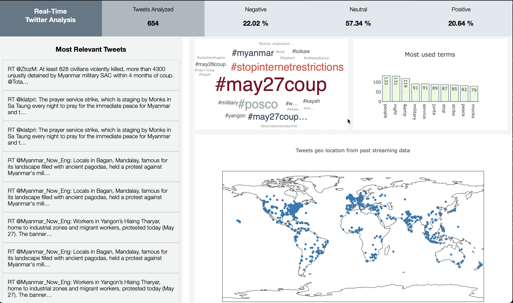

# Topic modelling and sentiment analysis on twitter data with Spark

## Authors
*  :woman_technologist: **Janice Tan Yi Xuan**
*  :woman_technologist: **Li Yishan**
*  :woman_technologist: **Ma Xiaojing**
*  :man_technologist: **Ranjit Khare**
*  :man_technologist: **Wang Xiaoyuan**

## Architecture
<h3 align="center">
  
</h3>

**Tweepy:** Tweepy is used to connect to twitter and get the historical and streaming data. Then, this data is saved to hdfs or sent to TCP-port.

**Spark SQL/MLlib:** Load the messages from HDFS and process them, and saves the result for visulisation in matplotlib or Tableau.

**Spark Streaming:** Consumes the messages from TCP-port and process them, and sends them to Flask server.

**Flask:** Python web framework, which receives the data from Spark and shows dashboards.

## Dashboard
<h3 align="center">
  
</h3>

## Demonstration

## Instructions

Tweepy:
1. run "Full archive tweet tweepy-v4.ipynb" for historical data extraction
2. run "Stream tweet tweepy.ipynb" for real time data extraction and sending to TCP port

Spark SQL/MLlib:
1. install pyspark
2. run "Tweet LDA.ipynb" for data processing and modelling

Visulization:
1. install bar_chart_race
2. run "AprTweetsBarChart.ipynb" to create bar chart race video

Spark Streaming
1. run "Tweet stream process.ipynb" to process real time data and send to Flask server

Flask:
1.  Run the flask.rc file in this project (source flask.rc)
2.  Run "flask run", this starts the application by default in localhost:5000

